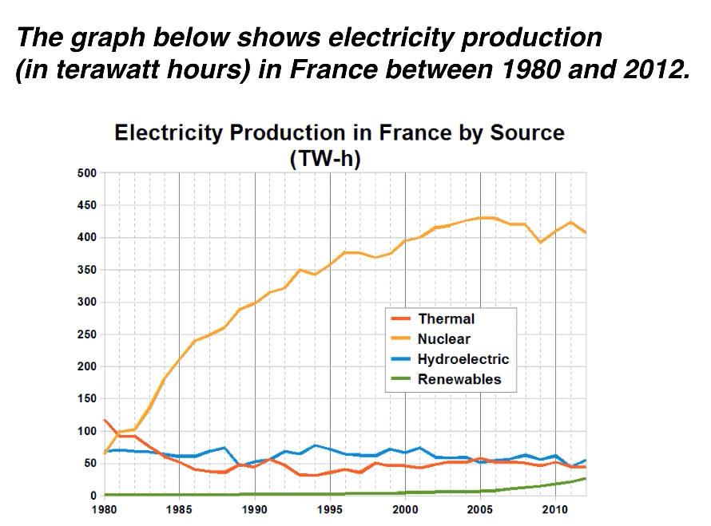

# 1.task 1 -line chart
Paragraph 1: Introduction（引言段） —— 改写题目（Paraphrase）。1句话

Paragraph 2: Overview（概述段） —— 找出2个最主要的总体趋势（不带具体数据）。2句话，最高和最低

Paragraph 3: Details（细节段 1） —— 比较特定时间点或起始阶段的数据。2-3句话 起点与交叉点

Paragraph 4: Details（细节段 2） —— 比较后续的发展变化、峰值或稳定期。3-4句话 后续趋势与终点

### 📋 模版公式

| 段落布局                         | 高分通用模版句型（**加粗**部分为固定框架）                                                                                                                                                                                                                                                                                                                                                                |
| ---------------------------- | -------------------------------------------------------------------------------------------------------------------------------------------------------------------------------------------------------------------------------------------------------------------------------------------------------------------------------------------------------------------------------------- |
| **Paragraph 1** Introduction | **The line graph compares the amount/percentage of** [描述对象] **in** [地点] **using** [分类数量] **different categories over a period of** [总年数] **years.**                                                                                                                                                                                                                                    |
| **Paragraph 2** Overview     | **It is clear that** [主导/最高线条] **was by far the most important means of** [核心话题] **over the period shown. By contrast,** [垫底/最低线条] **provided the lowest figures in each year.**                                                                                                                                                                                                       |
| **Paragraph 3** Details 1    | **In** [起始年份]**,** [A项目] **was the main source of** [核心话题]**, generating/recording around** [数据+单位]**.**[B项目] **and** [C项目] **produced/reached just under** [数据+单位] **each, while** [D项目] **provided a negligible amount. Just** [时间跨度] **later,** [A/B项目] **overtook** [另一个项目] **as the primary** [描述对象]**.**                                                                         |
| **Paragraph 4** Details 2    | **Between** [年份] **and** [年份]**, the figure for** [X项目] **rose dramatically to a peak of** [数据+单位]**. By contrast, the investment/production of** [Y项目] **fell to only** [数据] **in** [年份]**, and remained at this level for the rest of the period. Meanwhile,** [Z项目] **remained relatively stable, but** [最后一项项目] **saw only a small rise to approximately** [数据] **by** [最终年份]**.** |

### 🛠️ 考场填空替换指南

1. **话题替换**：如果是肉类消耗量题目，把模版里的 `means of electricity generation` 替换为 `types of meat consumption`；如果是失业率题目，替换为 `trends of unemployment`。
2. **单位统一**：首次在细节段引出数字时，必须写上单位（如：`terawatt hours`, `%`, `tonnes`），全文的数据单位保持高度统一。
3. **动态动词微调**：如果线条是平稳的，保留 `remained relatively stable`；若是平稳下降，可将 `rose dramatically` 替换为 `decreased steadily`。

范文：
### 【完整范文】
> **Paragraph 1: Introduction**
> The line graph compares the amount of electricity produced in France using four different sources of power over a period of 32 years.

> **Paragraph 2: Overview**
> It is clear that nuclear power was by far the most important means of electricity generation over the period shown. By contrast, renewables provided the lowest amount of electricity in each year.

> **Paragraph 3: Details (1980-1981)**
> In 1980, thermal power stations were the main source of electricity in France, generating around 120 terawatt hours of power. Nuclear and hydroelectric power stations produced just under 75 terawatt hours of electricity each, and renewables provided a negligible amount. Just one year later, nuclear power overtook thermal power as the primary source of electricity.

> **Paragraph 4: Details (1981-2012)**
> Between 1980 and 2005, electricity production from nuclear power rose dramatically to a peak of 430 terawatt hours. By contrast, the figure for thermal power fell to only 50 terawatt hours in 1985, and remained at this level for the rest of the period. Hydroelectric power generation remained relatively stable, at between 50 and 80 terawatt hours, for the whole 32-year period, but renewable electricity production saw only a small rise to approximately 25 terawatt hours by 2012.

### 【范文中文翻译】

> **Paragraph 1: 引言**
> 折线图比较了32年间法国使用四种不同能源生产的电量。
> 
> **Paragraph 2: 概述**
> 很明显，在所示期间内，核能绝对是最重要的发电方式。相比之下，可再生能源每年的发电量都是最低的。
> 
> **Paragraph 3: 细节 (1980-1981)**
> 在1980年，火力发电站是法国主要的电力来源，发电量约为120太瓦时。核能和水力发电站各自的发电量略低于75太瓦时，而可再生能源的发电量微乎其微。仅仅一年后，核能就超过了火力发电，成为主要的电力来源。
> 
> **Paragraph 4: 细节 (1981-2012)**
> 在1980年至2005年间，核能的发电量急剧上升，达到了430太瓦时的峰值。相比之下，火力发电的数据在1985年降至仅50太瓦时，并在该期间的剩余时间里保持在这一水平。在整个32年期间，水力发电量保持相对稳定，在50至80太瓦时之间，但可再生能源发电量到2012年仅出现了小幅上升，达到约25太瓦时。

## 雅思 Task 1 折线图/趋势图核心结构速查表（建议直接收藏）

| 结构                                 | 结构拆解                        | 中文意思     | 例句                                        |
| ---------------------------------- | --------------------------- | -------- | ----------------------------------------- |
| **the figure for...**              | figure → for + 对象           | ……的数据    | the figure for nuclear power              |
| **the amount of...**               | amount → of + 名词            | ……的数量    | the amount of electricity                 |
| **the level of...**                | level → of + 名词             | ……的水平    | the level of production                   |
| **electricity production from...** | production → from + 来源      | 来自……的发电量 | electricity production from nuclear power |
| **rise to...**                     | rise → to + 数值              | 上升到……    | rose to 400 TWh                           |
| **rise from A to B**               | rise → from A → to B        | 从A增长到B   | rose from 50 to 400                       |
| **rise by...**                     | rise → by + 增量              | 增加了……    | rose by 100 TWh                           |
| **saw a rise**                     | see → a rise                | 出现增长     | sales saw a rise                          |
| **experienced a rise**             | experience → a rise         | 经历增长     | production experienced a rise             |
| **fall to...**                     | fall → to + 数值              | 下降到……    | fell to 50 TWh                            |
| **fall from A to B**               | fall → from A → to B        | 从A降到B    | fell from 120 to 50                       |
| **fall by...**                     | fall → by + 数值              | 下降了……    | fell by 70 TWh                            |
| **saw a fall**                     | see → a fall                | 出现下降     | the figure saw a fall                     |
| **reach a peak of...**             | reach → peak → of + 数值      | 达到峰值……   | reached a peak of 430 TWh                 |
| **peak at...**                     | peak → at + 数值              | 峰值达到……   | peaked at 430 TWh                         |
| **hit a peak of...**               | hit → peak → of + 数值        | 达到峰值……   | hit a peak of 430 TWh                     |
| **reach a low of...**              | reach → low → of + 数值       | 降至最低点……  | reached a low of 50 TWh                   |
| **fall to a low of...**            | fall → low → of + 数值        | 跌至最低点……  | fell to a low of 50                       |
| **bottom out at...**               | bottom out → at + 数值        | 触底于……    | bottomed out at 50                        |
| **remain stable**                  | remain → stable             | 保持稳定     | remained stable                           |
| **remain unchanged**               | remain → unchanged          | 保持不变     | remained unchanged                        |
| **remain constant**                | remain → constant           | 维持恒定     | remained constant                         |
| **remain at...**                   | remain → at + 数值            | 保持在……    | remained at 50                            |
| **level off at...**                | level off → at + 数值         | 稳定在……    | levelled off at 50                        |
| **fluctuate between A and B**      | fluctuate → between A and B | 在A和B之间波动 | fluctuated between 50 and 80              |
| **show fluctuations**              | show → fluctuations         | 出现波动     | showed fluctuations                       |
| **overtake...**                    | A → overtake → B            | 超过……     | nuclear overtook thermal                  |
| **surpass...**                     | A → surpass → B             | 超过……     | sales surpassed costs                     |
| **exceed...**                      | A → exceed → B              | 高于……     | output exceeded 400                       |
| **overtake B as...**               | A → overtake B → as C       | 取代B成为C   | overtook thermal as the main source       |
| **account for...**                 | account for → 比例/数量         | 占据……     | accounted for 60%                         |
| **constitute...**                  | constitute → 比例             | 构成……     | constituted 40%                           |
| **stand at...**                    | stand → at + 数值             | 达到……     | stood at 100                              |
| **be recorded at...**              | be recorded → at + 数值       | 记录为……    | was recorded at 100                       |

---

# Overview（概述段）万能结构

| 结构                                           | 中文            |
| -------------------------------------------- | ------------- |
| **It is clear that...**                      | 很明显……         |
| **It is evident that...**                    | 显然……          |
| **Overall, it can be seen that...**          | 总体来看……        |
| **A was by far the most important...**       | A遥遥领先，是最重要的…… |
| **A dominated throughout the period.**       | A在整个时期占据主导地位。 |
| **By contrast, B...**                        | 相比之下，B……      |
| **B remained the least significant source.** | B始终是最不重要的来源。  |
| **The most noticeable feature is that...**   | 最明显的特征是……     |

---

# 时间表达万能结构

| 结构                                 | 中文            |
| ---------------------------------- | ------------- |
| **between 1980 and 2005**          | 1980年至2005年之间 |
| **from 1980 to 2005**              | 从1980年到2005年  |
| **over the period shown**          | 在图示期间         |
| **throughout the period**          | 整个期间          |
| **during the period**              | 在此期间          |
| **for the rest of the period**     | 在剩余时间里        |
| **for the whole 32-year period**   | 在整个32年期间      |
| **by 2012**                        | 到2012年为止      |
| **in 1985**                        | 在1985年        |
| **just one year later**            | 仅一年后          |
| **at the beginning of the period** | 在期初           |
| **at the end of the period**       | 在期末           |

---

# 描述变化幅度（高分词）

| 词汇            | 中文    |
| ------------- | ----- |
| dramatically  | 剧烈地   |
| sharply       | 急剧地   |
| significantly | 显著地   |
| considerably  | 相当地   |
| rapidly       | 快速地   |
| steadily      | 稳定地   |
| gradually     | 逐渐地   |
| slightly      | 轻微地   |
| marginally    | 略微地   |
| modestly      | 小幅地   |
| negligibly    | 微不足道地 |

---

## 考官最爱的5个黄金句型

### ① 达到峰值

```text
A rose dramatically to a peak of 430 TWh.
```

A剧烈增长至430 TWh的峰值。

---

### ② 下降后保持稳定

```text
A fell to 50 TWh and remained at this level.
```

A下降到50 TWh并保持在该水平。

---

### ③ 波动

```text
A fluctuated between 50 and 80 TWh.
```

A在50到80 TWh之间波动。

---

### ④ 超越

```text
A overtook B as the primary source.
```

A取代B成为主要来源。

---

### ⑤ 总览

```text
It is clear that A was by far the most important source, while B remained the least significant.
```

很明显，A遥遥领先成为最重要来源，而B始终是最不重要的来源。

