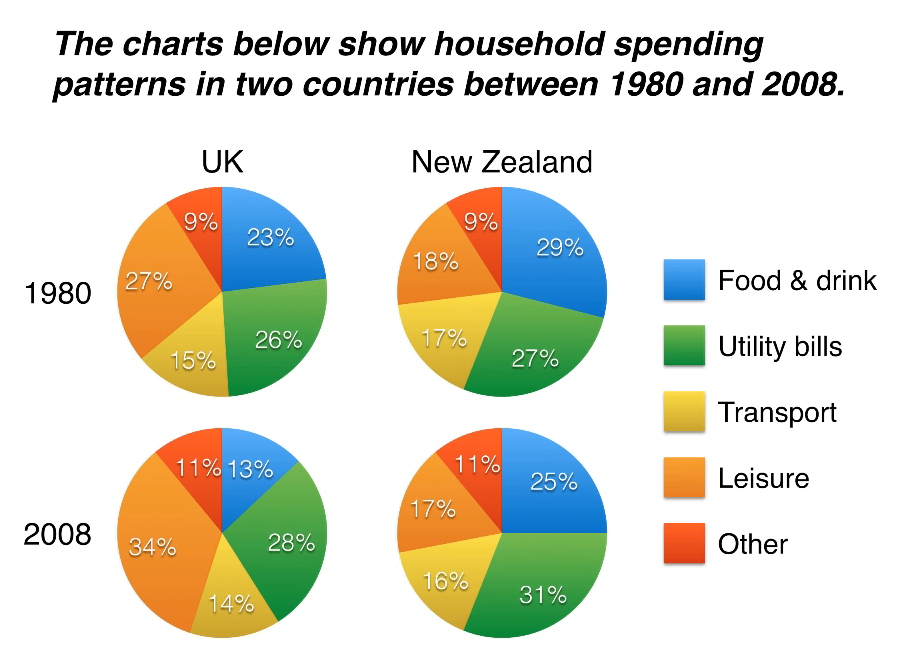

结合你提供的图文笔记与 Simon 老师在 `Lesson 04 - Pie chart.mp4` 视频中的核心教学，我为你将雅思小作文饼图（Pie Charts）的写作技巧、分组方法、核心时态陷阱、高分范文、以及中英双语的高分模版进行全面整合。

---

# 雅思写作 Task 1：饼图（Pie Charts）通关图文笔记

## 一、 视频中的核心写作技巧与三大铁律

### 1. 绝对主谓宾规范（拒绝中式英语）

Simon 老师在视频中强调（11:35左右），千万不要用项目名称直接接百分比：

* ❌ *Leisure was 34% in the UK...*（休闲本身不是百分比）
* ▲ **满分结构**：`Households spent 34% of their budget on leisure...` 或 `Leisure accounted for 34% of the total expenditure...`

### 2. 区分“动态（时间变化）”与“静态（非时间对比）”语言

本课所讲的“英国与新西兰家庭记账支出”属于既有国家对比、又有时间跨度（1980 vs 2008）的综合动态饼图：

* **有时间变化时**：必须使用趋势动词（`rose by` / `fell` / `saw an increase`）。
* **无时间变化（纯静态）时**：只能用比较级（`higher than` / `twice as much as`），**严禁**使用增长或下降词汇。

### 3. 高级时态陷阱：过去完成时（Past Perfect）的妙用

这是本期视频中最隐蔽的提分点（13:33左右）：

* 如果使用时间介词 **`in`**：使用一般过去时。*“In 2008, food expenditure fell.”*
* 如果使用时间介词 **`by`**（表达“到……为止”）：**必须使用过去完成时**。*“By 2008, food expenditure **had fallen**.”*（这个时态细节在考官眼里是稳拿 8 分以上的语法表现）。

---

## 二、 饼图四段论“句数、字数与分组方法”

面对复杂的多个饼图（本课共4个饼图：英国2个年份、新西兰2个年份，共5个支出类别），Simon 老师给出了完美的无缝分组逻辑：

```
饼图细节段落分组（按类别属性分组，绝不按国家或年份分开写）
 ├── 🟡 Paragraph 3 (Details 1): 描述在 Overview 中提到的核心矛盾类别（Food/Drink 和 Utility bills）
 └── 🔴 Paragraph 4 (Details 2): 描述剩下的次要或新兴类别（Leisure, Transport 和 Other costs）

```

* **Paragraph 1: Introduction（引言段 — 1句话 | 20-25字）**：纯粹改写题目。交代饼图类型、对比的范畴、国家和具体年份。
* **Paragraph 2: Overview（概述段 — 2句话 | 35-45字）**：总结 2-3 个最宏观的特征（1个相似点，1个最大不同点）。**严禁出现数字**。
* **Paragraph 3: Details 1（细节段 1 — 3句话 | 50-60字）**：集中对比跨国家、跨年份的“饮食支出（下降）”与“能源账单（上升）”。
* **Paragraph 4: Details 2（细节段 2 — 3-4句话 | 60-70字）**：集中对比“娱乐、交通和其它支出”。“Other（其它）”这一类由于比较杂乱，放在最后一句一笔带过即可。

---
![[pie-img.png]]
## 三、 雅思官方九分范文与原文深度解析

### 【完整范文】

> **Paragraph 1: Introduction**
> 
> The pie charts compare five categories of household expenditure in the UK and New Zealand in the years 1980 and 2008.
> 
> **Paragraph 2: Overview**
> 
> It is clear that tracking across both countries, the proportion of spending on food and drink fell, while utility bills rose over the 28-year period. Additionally, UK households spent a significantly larger percentage of their budget on leisure than their New Zealand counterparts.
> 
> **Paragraph 3: Details (Food & Utilities)**
> 
> In 1980, food and drink accounted for the highest proportion of expenditure in both countries, at 44% in the UK and 29% in New Zealand. By 2008, this expenditure had fallen to 34% and 25% respectively. By contrast, the data for utility bills saw an increase in both nations. In New Zealand, utility costs rose from 15% to 26% of household budgets, overtaking food as the largest expense, while the UK figure increased from 13% to 28%.
> 
> **Paragraph 4: Details (Leisure, Transport & Other)**
> 
> Looking at the remaining categories, UK households spent 34% of their budget on leisure in 1980, whereas New Zealanders spent just 15%. By 2008, these figures had fallen slightly to 28% and 13%. Transport costs, however, showed opposite trends, rising to 17% in New Zealand but falling to 9% in the UK. Finally, the lowest proportions of spending went on other costs in both years.

### 【范文中文翻译】

> **Paragraph 1: 引言**
> 
> 饼图对比了1980年和2008年英国和新西兰五个类别的家庭支出情况。
> 
> **Paragraph 2: 概述**
> 
> 显而易见的是，在这28年期间，纵观这两个国家，食品和饮料支出的比例均有所下降，而公用事业账单的支出比例则有所上升。此外，英国家庭在休闲娱乐上的预算比例显著高于其对应的新西兰家庭。
> 
> **Paragraph 3: 细节 (食品与公用事业)**
> 
> 在1980年，食品和饮料在两国均占支出比例最高，在英国为44%，在新西兰为29%。到2008年为止，这一支出已分别下降到34%和25%。相比之下，两国公用事业账单的数据均有所上升。在新西兰，公用事业成本从家庭预算的15%升至26%，超过食品成为最大的开销，而英国的数据则从13%增加到28%。
> 
> **Paragraph 4: 细节 (休闲、交通及其他)**
> 
> 看看剩下的类别，1980年英国家庭在休闲娱乐上花费了预算的34%，而新西兰人仅花费了15%。到2008年为止，这些数据略微下降，分别为28%和13%。然而，交通成本呈现出相反的趋势，在新西兰上升到17%，但在英国下降到9%。最后，在这两年中，最低的支出比例都花在了其他费用上。

---

### 【范文深度亮点解析】

* **第1段（引言）**：完美改写。将原题的名词 `spending patterns` 成功替换为 `categories of household expenditure`；并且用 `in the years 1980 and 2008` 精确列出对比维度。
* **第2段（概述）**：结构极其清晰。第一句抓住了两个国家的**共同趋势**（饮食都降了，账单都升了）；第二句抓住了两个国家的**核心差异**（英国人在休闲娱乐上的支出 `significantly larger percentage` 明显高于新西兰人）。全段无任何数字。
* **第3段（细节1）**：数据对比精妙。第一句先给出 1980 年饮食的最高占比；第二句马上用过去完成时说“到2008年，这个数字**已经分别下滑了**（`had fallen... respectively`）”。接着用 `By contrast` 引入账单的上升，并指出了新西兰账单超越饮食成为最大开销（`overtaking food as the largest expense`）这一关键转折。
* **第4段（细节2）**：处理次要数据干脆利落。首先对比了英国和新西兰在娱乐上的巨大鸿沟（34% vs 15%）；接着指出交通费呈现了“相反的趋势（`showed opposite trends`）”；最后用 `Finally` 引导，把完全不重要的 “Other costs” 打包放在最后一句一笔带过。

---

## 四、 Pie Chart（饼图）通用高分写作模版（中英对照）

这套模版专为涉及“多国/多组别、多时间段”的复杂饼图设计。

### 📋 模版公式

| 段落布局 | 高分通用模版句型（**加粗**部分为固定框架） |
| :--- | :--- |
| **Paragraph 1**<br>Introduction | **The pie charts compare [分类数量] categories of [核心话题] in [地点A] and [地点B] in the years [起始年] and [最终年].**<br>*(中: 该饼图对比了[地点A]和[地点B]在[起始年]和[最终年]中[分类数量]个类别的[核心话题]情况。)* |
| **Paragraph 2**<br>Overview | **It is clear that tracking across both countries, the proportion of spending on [项目X] fell, while [项目Y] rose over the period shown. Additionally, [地点A] spent a significantly larger percentage of their budget on [项目Z] than their [地点B] counterparts.**<br>*(中: 显而易见的是，纵观这两个国家，在所示期间内[项目X]的支出比例下降了，而[项目Y]上升了。此外，[地点A]在[项目Z]上的预算比例显著高于其对应的[地点B]。)* |
| **Paragraph 3**<br>Details 1 | **In [起始年], [项目X] accounted for the highest proportion of expenditure in both nations, at [数据] in [地点A] and [数据] in [地点B]. By [最终年], this expenditure had fallen to [数据] and [数据] respectively. By contrast, the data for [项目Y] saw an increase. In [地点B], its costs rose from [数据] to [数据], while the [地点A] figure increased from [数据] to [数据].**<br>*(中: 在[起始年]，[项目X]在两个国家中都占有最高的支出比例，在[地点A]为[数据]，在[地点B]为[数据]。到[最终年]为止，这项支出已分别下降到[数据]和[数据]。相比之下，[项目Y]的数据则有所上升。在[地点B]，其成本从[数据]升至[数据]，而[地点A]的数据则从[数据]增加到[数据]。)* |
| **Paragraph 4**<br>Details 2 | **Looking at the remaining categories, [地点A] spent [数据] on [项目Z] in [起始年], whereas [地点B] spent just [数据]. By [最终年], these figures had changed to [数据] and [数据]. The figures for [项目W], however, showed opposite trends, rising to [数据] in [地点B] but falling to [数据] in [地点A]. Finally, the lowest proportions went on other costs in both years.**<br>*(中: 看看剩下的类别，[地点A]在[起始年]在[项目Z]上花费了[数据]，而[地点B]仅花费了[数据]。到[最终年]为止，这些数据变为了[数据]和[数据]。然而，[项目W]的数据呈现出相反的趋势，在[地点B]上升到[数据]，但在[地点A]下降到[数据]。最后，在这两年中，最低的比例都花在了其他费用上。)* |


### 🛠️ 考场高分词汇替换（饼图绝杀）

* `accounted for` / `made up` / `constituted`：占据（百分比）
* `the highest proportion` / `the largest share`：最高的比例/最大的份额
* `counterparts`：对应的人/对应的组别（例如：*UK's spending than their New Zealand counterparts*，避免重复写 *New Zealand households*）
* `respectively`：依次地（将多组数据和主体在一句话里按顺序完美对应）
# 雅思 Academic Task 1 饼图（Pie Chart）7-8分核心短语与句型速查表

饼图的核心不是 **rise/fall**，而是：

```text
占比（proportion）
份额（share）
构成（account for）
比较（larger/smaller percentage）
```

所以高分饼图范文里反复出现的是下面这些结构。

---

# 一、占比表达（★★★★★ 最重要）

|短语|中文|例句|
|---|---|---|
|account for|占据|Food accounted for 44% of expenditure.|
|make up|构成|Leisure made up 34% of household spending.|
|constitute|构成|Transport constituted 17% of the total budget.|
|represent|占据|Utility bills represented 28% of expenditure.|
|comprise|包含，占据|Food and leisure comprised more than half of total spending.|
|take up|占据|Housing costs took up a large proportion of the budget.|

---

# 二、比例表达（★★★★★）

|短语|中文|例句|
|---|---|---|
|the proportion of|……的比例|the proportion of spending on food|
|the percentage of|……的百分比|the percentage of expenditure on leisure|
|a share of|……的份额|transport accounted for a share of 17%|
|the largest proportion|最大比例|food accounted for the largest proportion|
|the smallest proportion|最小比例|other costs represented the smallest proportion|
|the highest percentage|最高百分比|leisure had the highest percentage|
|the lowest percentage|最低百分比|transport recorded the lowest percentage|

---

# 三、支出类表达（★★★★★）

|短语|中文|例句|
|---|---|---|
|household expenditure|家庭支出|household expenditure increased|
|household budgets|家庭预算|utility costs accounted for 26% of household budgets|
|spending on|……方面的支出|spending on food and drink|
|expenditure on|……方面的开销|expenditure on leisure|
|household spending|家庭消费|household spending patterns|
|consumer expenditure|消费者支出|consumer expenditure on transport|

---

# 四、上升下降（★★★★★）

|短语|中文|例句|
|---|---|---|
|rise from A to B|从A上升到B|utility costs rose from 15% to 26%|
|increase from A to B|从A增加到B|expenditure increased from 10% to 20%|
|climb to|上升到|transport climbed to 17%|
|grow to|增长到|spending grew to 30%|
|fall from A to B|从A下降到B|food expenditure fell from 44% to 34%|
|decline from A to B|从A下降到B|leisure declined from 34% to 28%|
|drop to|下降到|the figure dropped to 13%|

---

# 五、比较表达（★★★★★）

|短语|中文|例句|
|---|---|---|
|whereas|而，相比之下|UK households spent 34%, whereas New Zealanders spent 15%|
|while|而|food fell while utilities rose|
|by contrast|相比之下|By contrast, utility bills increased|
|compared with|与……相比|Compared with transport, leisure was much higher|
|in comparison with|与……相比|In comparison with food, transport accounted for less spending|
|similarly|同样地|Similarly, expenditure on housing increased|
|respectively|分别地|44% and 29% respectively|

---

# 六、排名表达（★★★★★）

|短语|中文|例句|
|---|---|---|
|account for the largest proportion|占最大比例|food accounted for the largest proportion|
|account for the smallest proportion|占最小比例|other costs accounted for the smallest proportion|
|be the largest category|是最大类别|food was the largest category|
|be the smallest category|是最小类别|transport was the smallest category|
|become the largest expense|成为最大支出|utilities became the largest expense|
|rank first|排名第一|leisure ranked first|
|rank last|排名最后|other costs ranked last|

---

# 七、超越表达（★★★★★）

|短语|中文|例句|
|---|---|---|
|overtake A as B|超过A成为B|utility costs overtook food as the largest expense|
|surpass|超过|transport surpassed leisure|
|exceed|超过|utility spending exceeded food expenditure|
|become the dominant category|成为主导类别|utilities became the dominant category|
|become the major expense|成为主要开销|housing became the major expense|

---

# 八、Overview万能句（★★★★★）

|句型|中文|
|---|---|
|It is clear that...|很明显……|
|Overall, it can be seen that...|总体来看……|
|The most noticeable feature is that...|最明显的特点是……|
|A accounted for the largest proportion in both years.|A在两年中占比最大。|
|Spending on A declined, while expenditure on B increased.|A支出下降，而B支出上升。|
|A remained the largest category throughout the period.|A始终是最大的类别。|
|B became the dominant expense by the end of the period.|到期末B成为主要支出。|

---

# 九、Details万能句（★★★★★）

|句型|中文|
|---|---|
|In 1980, A accounted for 44% of expenditure.|1980年A占44%。|
|By 2008, this figure had fallen to 34%.|到2008年该数字降至34%。|
|The proportion of spending on A fell.|A支出占比下降。|
|The percentage allocated to A increased.|分配给A的比例上升。|
|A overtook B as the largest expense.|A超过B成为最大支出。|
|A represented the smallest share in both years.|A在两年中占比最小。|

---

# 十、Simon范文最值得背的20个饼图结构

|结构|中文|
|---|---|
|household expenditure|家庭支出|
|household budgets|家庭预算|
|spending on|……支出|
|expenditure on|……开销|
|account for|占据|
|the proportion of|……比例|
|the percentage of|……百分比|
|the largest proportion|最大占比|
|the smallest proportion|最小占比|
|the largest expense|最大开销|
|utility bills|公用事业账单|
|food and drink|食品饮料|
|leisure spending|休闲支出|
|transport costs|交通成本|
|other costs|其他开销|
|by contrast|相比之下|
|whereas|然而|
|respectively|分别地|
|overtake A as B|超过A成为B|
|remain the largest category|保持最大类别|

---

# 饼图7分万能骨架

```text
Introduction
↓
The pie charts compare...

Overview
↓
Overall, A accounted for the largest proportion,
whereas B represented the smallest share.

Details 1
↓
A accounted for X%.
This figure rose/fell to Y%.

Details 2
↓
B overtook C as the largest expense.
D remained the smallest category.
```

如果你把上面这 20 个核心结构背熟，基本可以覆盖剑桥雅思饼图范文中 **80%以上的高频表达**，足以支撑 **Band 7–7.5** 的 Task 1 语言部分。