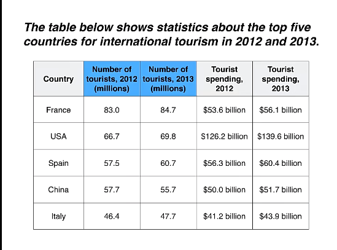

[NO CONTENT FOUND]这节课程是雅思前任考官 Simon 老师关于表格题（Tables）的经典教学。

在雅思小作文中，表格题本质上就是“穿了不同衣服的线图或柱状图”**。因为表格同样是在行与列中横纵交错地展示数字。Simon 老师在视频中强调，表格题最大的痛点不是不会写，而是**“信息量太大（通常有 20 多个数字），学生容易记流水账导致失分”。

以下结合你提供的图文笔记与 `Lesson 05 - Table.mp4` 视频内容，为您系统化总结本课的**写作技巧**、**高分范文**、**深度解析**以及表格题的**通用中英对照写作模版**。

## 一、 视频中的核心写作技巧与三大铁律

### 1. 20减两倍法则：学会“断舍离”选数据

Simon 老师指出，一幅典型的表格题往往包含 20 个左右的数据。**如果把所有数据都写进去，你的文章会变成数字清单，直接被判定为 5 分。**

- **黄金法则：** 20 分钟内，全文挑出大约 **10 个左右**的核心数字即可。
    
- **筛选优先级：** 必须死磕 **最高值（Highest）**、**最低值（Lowest）**、**剧烈变化点（Significant change）** 以及 **异常值/平稳值**。
    

### 2. 横纵向结合的分组艺术

本课的题目是“2012 和 2013 年全球前 5 大旅游国家的游客接待量以及旅游收入统计表”。面对“国家、年份、人数、支出”四个维度的庞大数据，Simon 的分组方法极度严规范（05:17左右）：

- **Paragraph 3（细节段 1）：** 纵向锁定左半边，**纯粹对比 5 个国家的“游客数量（Visits）”**。
    
- **Paragraph 4（细节段 2）：** 纵向锁定右半边，**纯粹对比 5 个国家的“旅游收入（Money spent）”**。
    

### 3. 表格题的灵魂——“大比例超越”高分句式

当表格中出现一个数字以压倒性优势吊打其他所有数字时（例如美国的旅游收入高达 1300 多亿，是其他国家的两到三倍），视频中给出了一个神级学术句式（10:53左右）：

- `... was well over twice as high as that of any other country.`（……足足是其他任何国家的两倍以上）。
    

## 二、 雅思官方九分范文（基于视频内容整理）

> **Paragraph 1: Introduction**
> 
> The table compares the five highest ranking countries in terms of the numbers of visits and the money spent by international tourists over a period of two years.
> 
> **Paragraph 2: Overview**
> 
> It is clear that France was the world’s most popular tourist destination in the years 2012 and 2013. However, the USA earned by far the most revenue from tourism over the same period.
> 
> **Paragraph 3: Details (Tourist Arrivals)**
> 
> In 2012, France received 83 million international visitors, followed by the USA with 66.7 million. Spain and China recorded around 58 million visits each, while Italy ranked fifth with 46.4 million. In 2013, tourist arrivals increased by between 1 and 4 million in all countries except China, which saw a drop of 2 million tourists to 55.7 million.
> 
> **Paragraph 4: Details (Tourism Revenue)**
> 
> Looking at tourism spending, the figure for the USA rose from 126.2 billion dollars in 2012 to 139.6 billion in 2013, which was well over twice as high as the revenue generated by any other country on the list. Spain ranked second with income increasing from 56.3 billion to 60.4 billion dollars. Finally, France, China and Italy all recorded lower tourism revenues of between 40 and 56 billion dollars in both years.

### 【范文中文翻译】

> **Paragraph 1: 引言**
> 
> 该表格对比了在两年期间，排名前五位的国家在国际游客访问次数和消费金额方面的数据。
> 
> **Paragraph 2: 概述**
> 
> 显而易见的是，法国在2012年和2013年是全球最受欢迎的旅游目的地。然而，在此期间，美国从旅游业中赚取的收入遥遥领先。
> 
> **Paragraph 3: 细节 (游客到访量)**
> 
> 2012年，法国接待了8300万国际游客，紧随其后的是美国，为6670万。西班牙和中国各自记录了约5800万访问人次，而意大利以4640万位居第五。2013年，除中国外的所有国家游客到访量都增加了100万到400万之间，而中国游客人数则下降了200万，至5570万。
> 
> **Paragraph 4: 细节 (旅游收入)**
> 
> 看看旅游消费方面，美国的数据从2012年的1262亿美元上升到2013年的1396亿美元，这足足是榜单上其他任何国家所创造收入的两倍以上。西班牙位列第二，其收入从563亿增加到604亿美元。最后，法国、中国和意大利在这两年里记录的旅游收入都较低，介于400亿和560亿美元之间。

## 三、 范文深度亮点解析（含句数规划）

### 第 1 段：Introduction（引言段 —— 1句话）

- **解析：** 完美避开题目原词。将 `top 5 countries for international tourism` 高级改写为 `the five highest ranking countries`；将大概念 `statistics` 拆解为极其具体的 `the numbers of visits and the money spent`（访问数量与花费的金额）。
    

### 第 2 段：Overview（概述段 —— 2句话，无数字）

- **解析：** * _第一句：_ 抓住**数量维度的老大** —— 法国是最受欢迎的目的地。
    
    - _第二句：_ 用转折词 `However` 抓住**金额维度的老大** —— 美国赚了最多的钱（运用高阶词 `by far the most revenue`）。
        
    - 全段完美展示了 2 个最显著的特征，不带任何数字，考官必给高分。
        

### 第 3 段：Details 1（细节段 1 —— 2句话，聚焦游客数量）

- **解析：** * 第一句用极简的排比一口气交代完 2012 年 5 个国家的人数，中间还用 `each` 合并了同为 5800 万的西班牙和中国，展现了极强的文字压缩能力。
    
    - 第二句描写 2013 年的变化，再次展现高级概括力：一句话总结了“除中国外其余四国全部上涨 1-4 百万”，并单独拎出中国的异常下跌（`saw a drop of`）。2 句话把 10 个数字清洗得干净利落。
        

### 第 4 段：Details 2 —— 3句话，聚焦旅游支出）

- **解析：** * 第一句直接抛出全图最大的高光数据 —— 美国的 1396 亿。并接上绝杀后缀 `which was well over twice as high as...`，直接锁定了高分段的语法增值分。
    
    - 最后一句面对散落的法、中、意三国数据，作者没有一个个去记流水账，而是再次使用**打包区间法**：_“of between 40 and 56 billion dollars”_，把不重要的中下游数字一笔带过，太聪明了！
        

## 四、 Table Chart（动态表格题）通用高分写作模版（中英对照）

这套模版专为行、列清晰，涉及“多国/多项目、双年份变化”的复杂表格设计。

### 📋 模版公式

| 段落布局                            | 高分通用模版句型（**加粗**部分为固定框架）                                                                                                                                                                                                                                                                                                                                                                                                                                                                  |
| :------------------------------ | :--------------------------------------------------------------------------------------------------------------------------------------------------------------------------------------------------------------------------------------------------------------------------------------------------------------------------------------------------------------------------------------------------------------------------------------------------------------------------------------- |
| **Paragraph 1** Introduction | **The table compares the [数量] highest ranking [主体] in terms of the [指标A] and the [指标B] over a period of [总年数] years.** *(中: 该表格对比了在前[数量]名的[主体]在[指标A]和[指标B]方面在[总年数]年间的数据。)*                                                                                                                                                                                                                                                                                                            |
| **Paragraph 2** Overview     | **It is clear that [主体A] was the world’s most popular [核心话题] in the years [年份] and [年份]. However, [主体B] ranked by far the highest in terms of [指标B] over the same period.** *(中: 显而易见的是，[主体A]在某年和某年是世界上最受欢迎的[核心话题]。然而，在此期间，[主体B]在[指标B]方面的排名高居首位。)*                                                                                                                                                                                                                                    |
| **Paragraph 3** Details 1    | **In [起始年], [主体A] received [数据], followed by [主体B] with [数据]. [主体C] and [主体D] recorded around [数据] each, while [主体E] ranked fifth with [数据]. In [最终年], the figures increased by between [差额] and [差额] in all categories except [特殊主体], which saw a drop of [差额] to [数据].** *(中: 在起始年，[主体A]接待/记录了[数据]，紧随其后的是[主体B]有[数据]。[主体C]和[主体D]分别记录了大约[数据]，而[主体E]以[数据]位居第五。在最终年，除了[特殊主体]经历了[数据]的下跌至[数据]外，所有类别的数据都增加了[差额]到[差额]之间。)*                                                                  |
| **Paragraph 4** Details 2    | **Looking at [指标B], the figure for [主体B] rose from [数据] in [起始年] to [数据] in [最终年], which was well over twice as high as the [数据/表现] generated by any other [主体] on the list. [主体C] ranked second with [数值] increasing from [数据] to [数据]. Finally, the remaining countries all recorded lower figures of between [下限] and [上限] in both years.** *(中: 看看[指标B]，[主体B]的数据从起始年的[数据]上升到最终年的[数据]，这足足是榜单上其他任何[主体]所产生的[数据]的两倍以上。[主体C]位列第二，其数值从[数据]增加到[数据]。最后，其余国家在这两年里记录的数据都较低，介于[下限]和[上限]之间。)* |

### 🛠️ 考场表格题绝杀词汇（建议背诵）

- `in terms of`：在……方面 / 从……角度来看（改写表格多指标的终极连接词）
    
- `followed by`：紧随其后的是……（用于多国排名顺序列举，避免一直写句号）
    
- `recorded ... each`：各自记录了……（只要发现表格里有数字相同或极度接近，立刻用 `each` 打包）
    
- `well over twice as high as`：足足是……的两倍以上（吊打中下游项目时的不二之选）