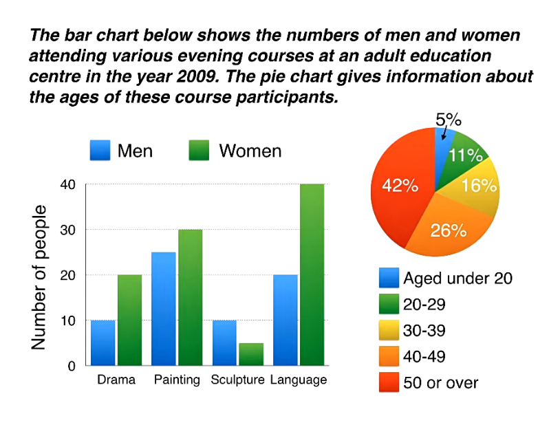

根据你上传的图文笔记以及 Simon 老师在 `Lesson 06 - 2 different charts.mp4` 视频中的教学内容，本课讲解的是雅思小作文中让很多考生头疼的**组合图/双图表题型（2 Different Charts: 柱状图 + 饼图）**。

这种题型表面上信息错综复杂（同时包含性别维度与年龄维度），但 Simon 老师在视频中指出了其底层逻辑：**正因为两个图表展示的信息完全不同，所以“不需要、也无法”将它们合在一起硬性比较，各自独立描述即可**。

以下为你深度总结本课的**写作方法、课程精髓、九分范文、深度解析**以及专门针对双图表定制的**通用高分写作模版**。

## 一、 视频中的核心写作技巧与三大组合图铁律

### 1. 独立宣告法则：两图绝不硬连

很多同学在写组合图时，喜欢主观臆断地把两个图表的数据连在一起（例如：猜测是不是50岁以上的女性特别喜欢上语言课）。Simon 老师强调，图表没有给出的关联，**绝对不要自己发明**。两个图表展示的是不同的维度（图1是课程和性别，图2是总人群的年龄分布），各写各的，各占一个细节段即可。

### 2. 概述段（Overview）的“一人一句”原则

双图表的概述段极好写，你只需要严格执行以下结构：

- **第一句**：概括图表一（柱状图）最显眼的特征。
    
- **第二句**：概括图表二（饼图）最显眼的特征。
    
- ⚠️ **注意**：依然严格禁止出现任何具体数字。
    

### 3. 数据引入的高级后缀句式（With / Attracting）

为了避免句子写成 _“The number of females was 40, and the number of males was 20”_ 这种小学生的流水账，视频里传授了考官最爱的**独立主格/伴随修饰句式**：

- `..., with 40 female and 20 male students.`
    
- `..., attracting 30 female attendees.`
    
    直接用 `with` 或 `attracting` 将具体数据挂在句子末尾，句子会变得极其精炼且极具学术感。
    

## 二、 组合图四段论“句数与数据归类方法”

Simon 老师为双图表量身定制的**完美黄金四段**如下：

```
组合图完美四段论（各司其职，结构清晰）
 ├── Paragraph 1 (Introduction): 一句话改写，用 and 把两个图表的主题串联起来
 ├── Paragraph 2 (Overview): 两句话，第一句写图1总特征，第二句写图2总特征
 ├── Paragraph 3 (Details 1): 纯写图1（柱状图）的男女课程学员数据
 └── Paragraph 4 (Details 2): 纯写图2（饼图）的年龄比例数据
```

- **第 1 段：Introduction（引言段 —— 1句话）**：改写题目。用 `and` 将两个图表各自的目的句连接成一个高级长难句。
    
- **第 2 段：Overview（概述段 —— 2句话）**：找出柱状图里的性别差异，以及饼图里最突出的年龄段。
    
- **第 3 段：Details 1（细节段 1 —— 3句话）**：**只写第一个图表**。先用标志词 `According to the bar chart` 划定范围，然后对比最受欢迎、次受欢迎及男性反超的课程。
    
- **第 4 段：Details 2（细节段 2 —— 3句话）**：**只写第二个图表**。用标志词 `Looking at the pie chart` 开头，对比老年多数群体（Majority）与年轻少数群体（Minority）。
    

## 三、 雅思官方九分范文与原文深度解析

### 【完整范文】

> **Paragraph 1: Introduction**
> 
> The bar chart compares the numbers of males and females who took four different evening classes at an adult education centre in 2009, and the pie chart shows the age profile of these attendees.
> 
> **Paragraph 2: Overview**
> 
> It is clear that significantly more women than men attended evening classes overall. In terms of age, the vast majority of people who took courses were aged 40 or over.
> 
> **Paragraph 3: Details (The Bar Chart)**
> 
> According to the bar chart, language classes had the highest number of participants overall, with 40 female and 20 male students. Painting was also a popular choice among both genders, attracting 30 female attendees and only slightly fewer men, at 25. By contrast, sculpture was the least popular course, and it was the only class where male students outnumbered females, with 15 men and around 10 women.
> 
> **Paragraph 4: Details (The Pie Chart)**
> 
> Looking at the age profile pie chart, we can see that people aged 50 or over represented the largest group of attendees, accounting for 42% of the total. The second largest group was those aged 40 to 49, at 26%. To be precise, older students made up over two-thirds of the participants. In contrast, the younger age groups were in the minority, with 20-to-29-year-olds making up 11% of the total, and under-20s representing a mere 5%.

### 【范文中文翻译】

> **Paragraph 1: 引言**
> 
> 该柱状图对比了2009年在一家成人教育中心参加四种不同晚间课程的男性和女性人数，而饼图则展示了这些参加者的年龄分布。
> 
> **Paragraph 2: 概述**
> 
> 显而易见的是，总体来看，参加晚间课程的女性明显多于男性。在年龄方面，绝大多数参加课程的人年龄都在40岁或以上。
> 
> **Paragraph 3: 细节 (柱状图)**
> 
> 根据该柱状图，语言课在整体上拥有最多的参与者人数，有40名女学生和20名男学生。绘画在两性中也是一个受欢迎的选择，吸引了30名女性参加者，而男性人数仅稍低，为25人。相比之下，雕塑是最不受欢迎的课程，而且它是唯一一个男性学生人数超过女性的班级，有15名男性和大约10名女性。
> 
> **Paragraph 4: 细节 (饼图)**
> 
> 看看年龄分布饼图，我们可以看到50岁及以上的人代表了最大的参与者群体，占总数的42%。第二大群体是40至49岁的人，占26%。准确来说，年长的学生占了参与者总数的三分之二以上。相比之下，较年轻的年龄组处于少数，其中20至29岁的人占总数的11%，而20岁以下的人仅占微不足道的5%。

### 【范文深度亮点解析】

- **第1段（引言）**：结构工整。前半句改写柱状图，把原题的名词 `participants` 巧妙转化为定语从句 `who took four different evening classes`；后半句直接无缝衔接饼图的主题 `the age profile of these attendees`。
    
- **第2段（概述）**：不拖泥带水。第一句指出柱状图的核心：**女性明显比男性多**（`significantly more women than men`）；第二句利用 `In terms of age` 指出饼图核心：**40岁及以上的人占了绝大多数**。两句话完美收尾。
    
- **第3段（细节1）**：数据高度凝练。第一句用 `with 40 female and 20 male students` 引入最火的语言课；第二句用现在分词 `attracting 30 female attendees...` 引入绘画课；第三句捕捉到了全图唯一的“异常交叉点”——雕塑课是唯一一个男性反超女性的课程（`male students outnumbered females`）。
    
- **第4段（细节2）**：展示了强大的数学概括力。作者看到50岁以上（42%）和40-49岁（26%），加起来接近 70%。他没有死板地单报数字，而是写了一句：`To be precise, older students made up over two-thirds of the participants.`（准确来说，年长学生占了**超过三分之二**的比例）。这种将百分比转化为分数的写法，在考官眼里是顶级的高分语法。最后用 `a mere 5%` 极其有力地强调了年轻人属于绝对弱势群体。
    

## 四、 2 Different Charts（双图表/组合图）通用高分写作模版（中英对照）

这套模版完全契合 Simon 老师“各司其职、各写一图”的组合图金牌逻辑。

### 📋 模版公式

| 段落布局 | 高分通用模版句型（**加粗**部分为固定框架） |
| :--- | :--- |
| **Paragraph 1**<br>Introduction | **The [图表1类型] compares [图表1改写主题], and the [图表2类型] shows [图表2改写主题].**<br>*(中: 该[图表1]对比了[图表1主题]，而[图表2]则展示了[图表2主题]。)* |
| **Paragraph 2**<br>Overview | **It is clear that [图表1最大总特征] overall. In terms of [图表2核心分类], the vast majority of [主体] were [图表2最大总特征].**<br>*(中: 显而易见的是，总的来看[图表1总特征]。在[图表2分类]方面，绝大多数[主体]都是[图表2特征]。)* |
| **Paragraph 3**<br>Details 1 | **According to the [图表1类型], [分类A] had the highest number of [主体] overall, with [数据1] and [数据2]. [分类B] was also a popular choice, attracting [数据3] and only slightly fewer/more [类别], at [数据4]. By contrast, [分类C] was the least popular, and it was the only category where [特殊情况, 如A超越了B], with [数据].**<br>*(中: 根据[图表1]，[分类A]在整体上拥有最高的[主体]数量，有[数据1]和[数据2]。[分类B]也是一个受欢迎的选择，吸引了[数据3]，而在另一类别中数量仅稍低/稍高，为[数据4]。相比之下，[分类C]最不受欢迎，且它是唯一一个[特殊情况]的类别，有[数据]。)* |
| **Paragraph 4**<br>Details 2 | **Looking at the [图表2类型], we can see that [类别X] represented the largest group, accounting for [百分比] of the total. The second largest group was [类别Y], at [百分比]. To be precise, these two categories made up over [分数, 如two-thirds] of the total. In contrast, the other groups were in the minority, with [类别Z] making up [百分比], and the remaining group representing a mere [百分比].**<br>*(中: 看看[图表2]，我们可以看到[类别X]代表了最大的群体，占总数的[百分比]。第二大群体是[类别Y]，为[百分比]。准确来说，这两个类别占了总数的[分数]。相比之下，其他组别处于少数，[类别Z]占[百分比]，而剩下的组别仅代表了微不足道的[百分比]。)*

### 🛠️ 考场高分词汇替换（组合图绝杀）

- `outnumbered`：数量上超过（例如：_males outnumbered females_，比写 _more than_ 高级得多）
    
- `a mere 5%`：仅仅 5%（带有强烈感情色彩的强调词，用来形容极小的数据，直接替换 _only_）
    
- `were in the minority`：处于少数地位
    
- `the vast majority of...`：绝大多数的……
    
- `profile`：概况/分布（例如：_age profile_ 年龄分布，_income profile_ 收入概况）


# 混合图（Bar Chart + Pie Chart）范文完整语法树分析

---

# Paragraph 1

## Sentence 1

> The bar chart compares the numbers of males and females who took four different evening classes at an adult education centre in 2009, and the pie chart shows the age profile of these attendees.

```text
The bar chart
      │
      ├─ compares
      │
      └─ the numbers
              │
              └─ of males and females
                        │
                        └─ who
                             │
                             ├─ took
                             │
                             └─ four different evening classes
                                         │
                                         └─ at an adult education centre
                                                     │
                                                     └─ in 2009
                                                             │
                                                             └─ and
                                                                  │
                                                                  ├─ the pie chart
                                                                  │
                                                                  ├─ shows
                                                                  │
                                                                  └─ the age profile
                                                                            │
                                                                            └─ of these attendees
```

主干：

```text
The bar chart
      │
      ├─ compares
      │
      └─ the numbers of males and females

and

The pie chart
      │
      ├─ shows
      │
      └─ the age profile
```

---

# Paragraph 2

## Sentence 2

> It is clear that significantly more women than men attended evening classes overall.

```text
It
│
├─ is
│
└─ clear
       │
       └─ that
             │
             ├─ significantly more women than men
             │
             ├─ attended
             │
             └─ evening classes
                        │
                        └─ overall
```

主干：

```text
more women than men
        │
        ├─ attended
        │
        └─ evening classes
```

---

## Sentence 3

> In terms of age, the vast majority of people who took courses were aged 40 or over.

```text
In terms of age
        │
the vast majority
        │
        └─ of people
                 │
                 └─ who
                      │
                      ├─ took
                      │
                      └─ courses
                               │
                               ├─ were aged
                               │
                               └─ 40 or over
```

主干：

```text
the vast majority of people
                │
                ├─ were aged
                │
                └─ 40 or over
```

---

# Paragraph 3

## Sentence 4

> According to the bar chart, language classes had the highest number of participants overall, with 40 female and 20 male students.

```text
According to the bar chart
               │
language classes
        │
        ├─ had
        │
        └─ the highest number
                    │
                    └─ of participants
                             │
                             └─ overall
                                     │
                                     └─ with
                                          │
                                          ├─ 40 female students
                                          └─ 20 male students
```

主干：

```text
language classes
        │
        ├─ had
        │
        └─ the highest number of participants
```

---

## Sentence 5

> Painting was also a popular choice among both genders, attracting 30 female attendees and only slightly fewer men, at 25.

```text
Painting
     │
     ├─ was
     │
     └─ a popular choice
              │
              └─ among both genders
                       │
                       └─ attracting
                               │
                               ├─ 30 female attendees
                               │
                               └─ only slightly fewer men
                                            │
                                            └─ at 25
```

主干：

```text
Painting
     │
     ├─ was
     │
     └─ a popular choice
```

---

## Sentence 6

> By contrast, sculpture was the least popular course, and it was the only class where male students outnumbered females, with 15 men and around 10 women.

```text
By contrast
      │
sculpture
      │
      ├─ was
      │
      └─ the least popular course
                     │
                     └─ and
                          │
                          ├─ it
                          │
                          ├─ was
                          │
                          └─ the only class
                                      │
                                      └─ where
                                            │
                                            ├─ male students
                                            │
                                            ├─ outnumbered
                                            │
                                            └─ females
                                                    │
                                                    └─ with
                                                         │
                                                         ├─ 15 men
                                                         └─ around 10 women
```

主干：

```text
sculpture
      │
      ├─ was
      │
      └─ the least popular course

it
 │
 ├─ was
 │
 └─ the only class
```

---

# Paragraph 4

## Sentence 7

> Looking at the age profile pie chart, we can see that people aged 50 or over represented the largest group of attendees, accounting for 42% of the total.

```text
Looking at the age profile pie chart
                    │
we
│
├─ can see
│
└─ that
      │
      ├─ people
      │      │
      │      └─ aged 50 or over
      │
      ├─ represented
      │
      └─ the largest group
                    │
                    └─ of attendees
                             │
                             └─ accounting for
                                      │
                                      └─ 42%
                                            │
                                            └─ of the total
```

主干：

```text
people aged 50 or over
            │
            ├─ represented
            │
            └─ the largest group
```

---

## Sentence 8

> The second largest group was those aged 40 to 49, at 26%.

```text
The second largest group
          │
          ├─ was
          │
          └─ those
                │
                └─ aged 40 to 49
                         │
                         └─ at 26%
```

主干：

```text
The second largest group
          │
          ├─ was
          │
          └─ those aged 40 to 49
```

---

## Sentence 9

> To be precise, older students made up over two-thirds of the participants.

```text
To be precise
       │
older students
       │
       ├─ made up
       │
       └─ over two-thirds
                     │
                     └─ of the participants
```

主干：

```text
older students
       │
       ├─ made up
       │
       └─ over two-thirds
```

---

## Sentence 10

> In contrast, the younger age groups were in the minority, with 20-to-29-year-olds making up 11% of the total, and under-20s representing a mere 5%.

```text
In contrast
      │
the younger age groups
           │
           ├─ were
           │
           └─ in the minority
                    │
                    └─ with
                         │
                         ├─ 20-to-29-year-olds
                         │        │
                         │        ├─ making up
                         │        │
                         │        └─ 11%
                         │                │
                         │                └─ of the total
                         │
                         └─ and
                              │
                              ├─ under-20s
                              │
                              ├─ representing
                              │
                              └─ a mere 5%
```

主干：

```text
the younger age groups
           │
           ├─ were
           │
           └─ in the minority
```

---

# 这篇范文最值得背的高分结构

## 1. 人数统计（Bar Chart）

| 结构                                  | 中文       |
| ----------------------------------- | -------- |
| the number of participants          | 参与人数     |
| the highest number of participants  | 参与人数最多   |
| the least popular course            | 最不受欢迎课程  |
| a popular choice among both genders | 男女都欢迎的选择 |
| male students                       | 男学生      |
| female students                     | 女学生      |
| attendees                           | 参与者      |
| participants                        | 参与者      |
| overall                             | 总体来看     |

---

## 2. 男女比较（★★★★★）

| 结构                                | 中文     |
| --------------------------------- | ------ |
| more women than men               | 女性多于男性 |
| outnumber                         | 数量超过   |
| male students outnumbered females | 男性多于女性 |
| only slightly fewer men           | 男性仅略少  |
| among both genders                | 在两性中   |

---

## 3. 饼图占比（★★★★★）

| 结构                          | 中文     |
| --------------------------- | ------ |
| represent the largest group | 占最大群体  |
| account for                 | 占据     |
| make up                     | 构成     |
| the second largest group    | 第二大群体  |
| over two-thirds             | 超过三分之二 |
| of the total                | 占总数    |
| in the minority             | 占少数    |
| a mere 5%                   | 仅仅5%   |
| the vast majority           | 绝大多数   |

---

## 4. 年龄结构（★★★★★）

| 结构                 | 中文       |
| ------------------ | -------- |
| age profile        | 年龄结构     |
| aged 50 or over    | 50岁及以上   |
| aged 40 to 49      | 40至49岁   |
| younger age groups | 年轻年龄组    |
| older students     | 年长学员     |
| under-20s          | 20岁以下    |
| 20-to-29-year-olds | 20-29岁人群 |

---

## 5. Overview万能句

| 句型                                | 中文        |
| --------------------------------- | --------- |
| It is clear that...               | 很明显……     |
| The vast majority of...           | 绝大多数……    |
| A represented the largest group.  | A占最大群体。   |
| A accounted for X% of the total.  | A占总数X%。   |
| A made up over half of the total. | A占总数一半以上。 |
| A was in the minority.            | A占少数。     |

---

# 混合图（Bar + Pie）7分模板

```text
Overview
↓
It is clear that more women than men attended the classes overall.

In terms of age,
the vast majority of participants were aged 40 or over.

Bar Chart
↓
A had the highest number of participants.

B was the least popular course.

Pie Chart
↓
People aged 50 or over represented the largest group,
accounting for 42% of the total.

Older participants made up over two-thirds of attendees.
```

这篇范文最核心、最值得直接背诵的表达是：

```text
the highest number of participants
a popular choice among both genders
outnumbered females
the age profile
represented the largest group
accounting for
made up
the vast majority
in the minority
a mere 5%
over two-thirds of the participants
```

这些是剑桥雅思涉及 **饼图、柱状图、混合图** 时最常见的 7分以上表达。
